<p align="right"><a href="https://kairulla.github.io/machine_learning_text_analysis_and_image_processing/">home page</a>

# 1.1 Вступление
```
Задание 1.1.1
Что такое машинное обучение?
    Процесс, в ходе которого алгоритм принимает на вход данные и учится находить в них закономерности
```
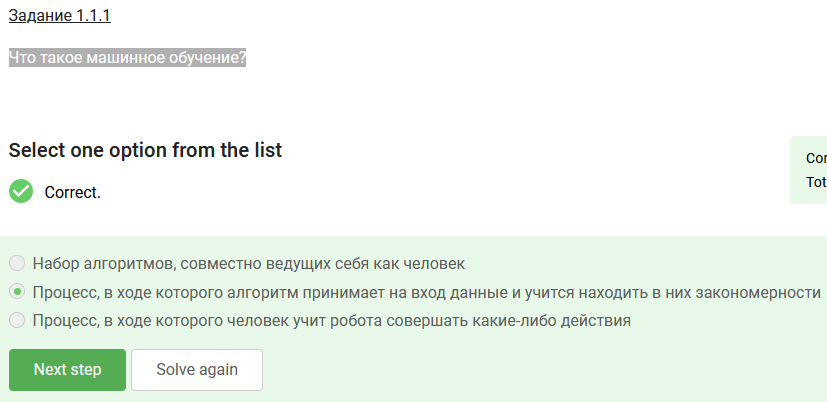

```
Задание 1.1.2
В каком порядке включают друг друга разные области анализа данных?
Используйте объяснение из курса.
Так как область новая, описания могут отличаться друг от друга в разных источниках.
Вы не обязаны соглашаться с автором курса в этом конкретном моменте.
```
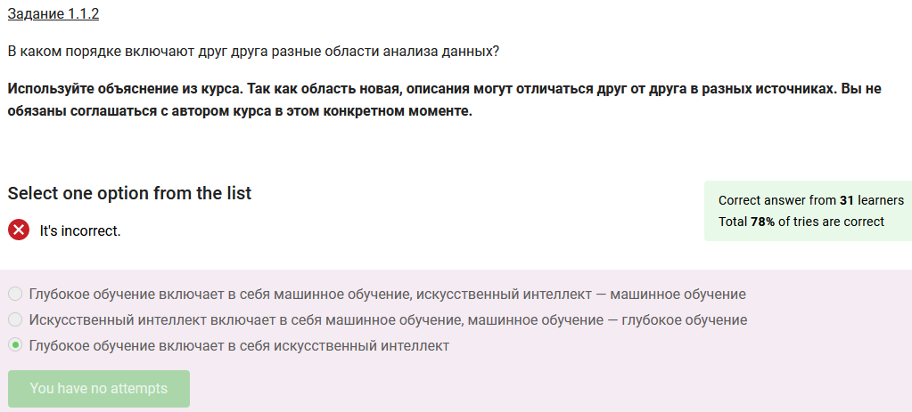


# 1.2 Типы алгоритмов
```
Задание 1.2.1
Предскажите время в секундах, через которое ваше оборудование сломается.
Вы знаете тип оборудования, его производителя, дату производства и ещё несколько признаков.
К каким классу и подклассу алгоритмов МО относится эта задача?
    Класс обучение с учителем, подкласс регрессия
```
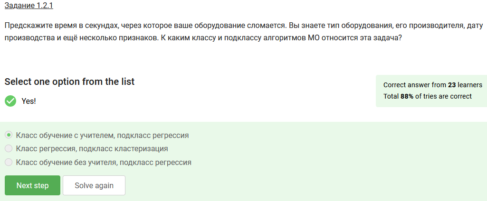

```
Задание 1.2.2
Кроме признаков, перечисленных в Задании 1.2.1, у вас есть ещё тысяча признаков,
что слишком много для анализа.
Каким классом алгоритмов вы воспользуетесь, чтобы признаков стало меньше?
    Обучение без учителя
```
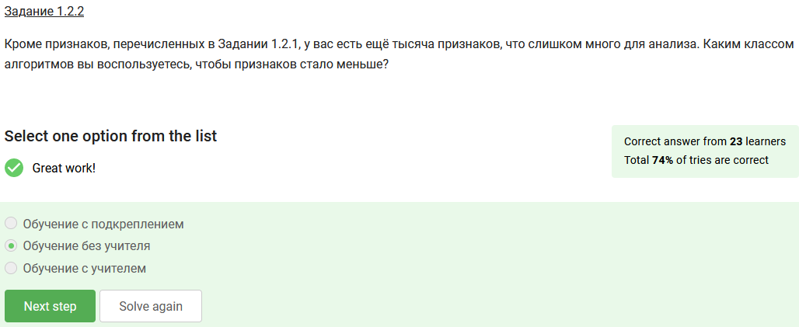

```
Задание 1.2.3
Выберите, как соотносятся между собой обучение с учителем и обучение с подкреплением:
    Эти классы похожи, но являются независимыми
```
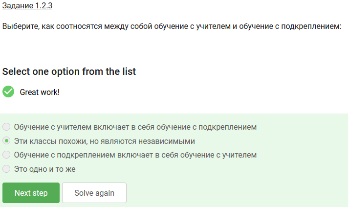

```
Задание 1.2.4
Задача — разбить пользователей интернет-магазина на группы, зная только информацию о их покупках.
Определите, какой это тип задачи МО?
    Кластеризация
```
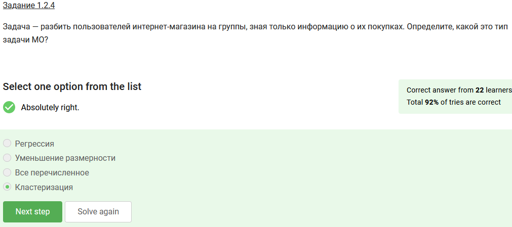


# 1.3 Задачи машинного обучения
```
Задание 1.3.1
Укажите, какой тип алгоритмов МО решает задачу определения спама в письмах:
    Классификация
```
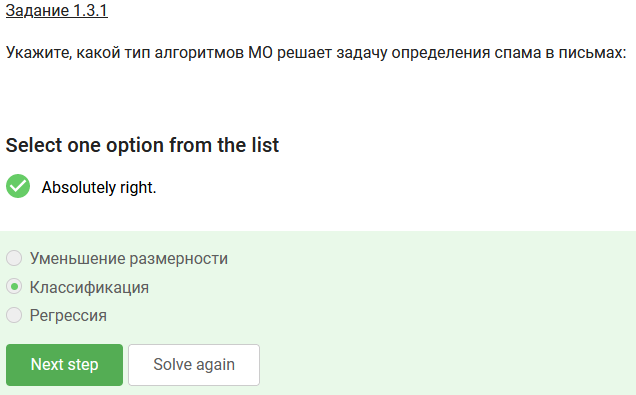

```
Задание 1.3.2
В каких задачах применяются алгоритмы компьютерного зрения?
    Беспилотные автомобили
    Классификация болезней по фото
```
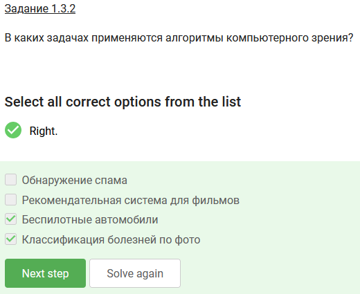

```
Задание 1.3.3
У вас есть беспилотный автомобиль, который смотрит на дорогу, определяет людей, разметку и дорожные знаки перед ним, считает расстояние до каждого человека и машин вокруг.
Выберите, какие задачи машинного обучения решает этот автомобиль:
```
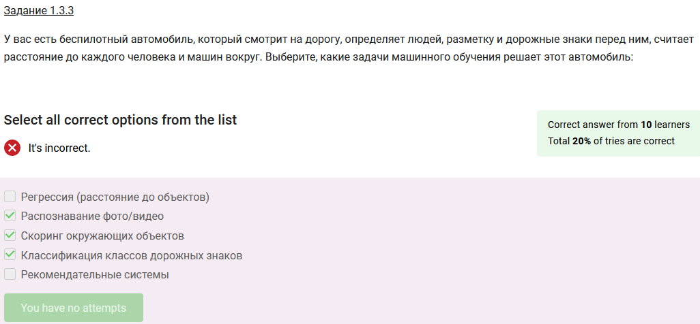


# 1.4 Частые вопросы машинного обучения
```
Задание 1.4.1
Что такое слабый (узкий, частный) искусственный интеллект?
    Специальный алгоритм, который можно обучить для решения конкретной узкой задачи
```
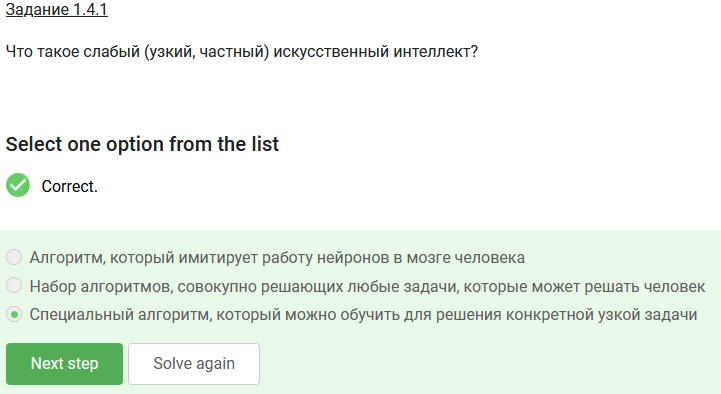

```
Задание 1.4.2
Существует ли сильный (широкий, общий) искусственный интеллект?
Если вы читаете этот вопрос в 2050 году, возможно, ответ будет другой.
    Нет
```
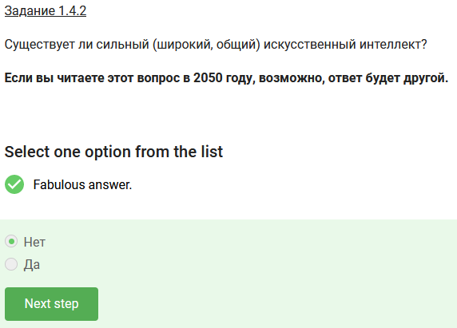

```
Задание 1.4.3
Выберите правдивое утверждение:
    Машинное обучение — это практическое применение статистики
```
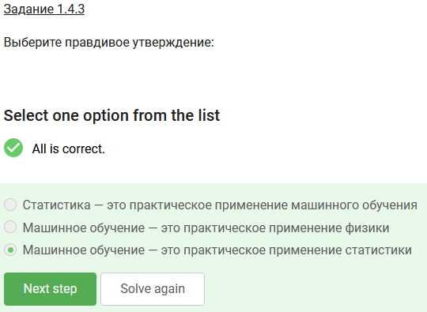


# 1.5 Методология разработки задач
```
Задание 1.5.1
Почему каскадная методология разработки редко применяется в Data Science-разработке?
    Каскадная модель слишком неповоротлива:
    она предполагает возможность заранее полностью определить, как мы можем решать задачу
```
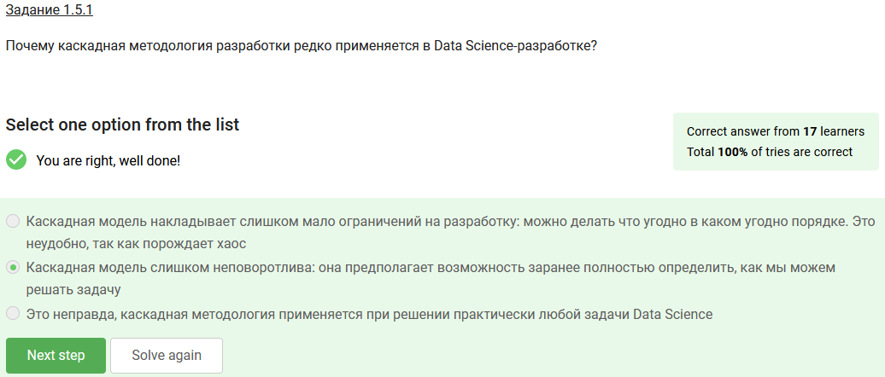

```
Задание 1.5.2
Что такое Insight Mining (поиск инсайтов)?
    Все перечисленное
```
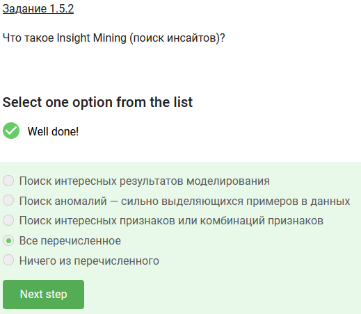

```
Задание 1.5.3
Выберите, на каких стадиях разработки мы занимаемся поиском инсайтов:
```
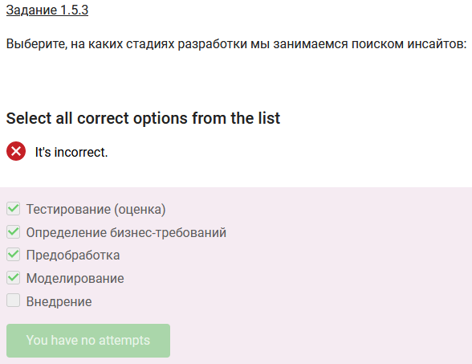

```
Задание 1.5.4
Как заранее определить, подтвердится гипотеза или нет?
    Заранее определить нельзя, можно лишь иметь некоторую степень уверенности
```
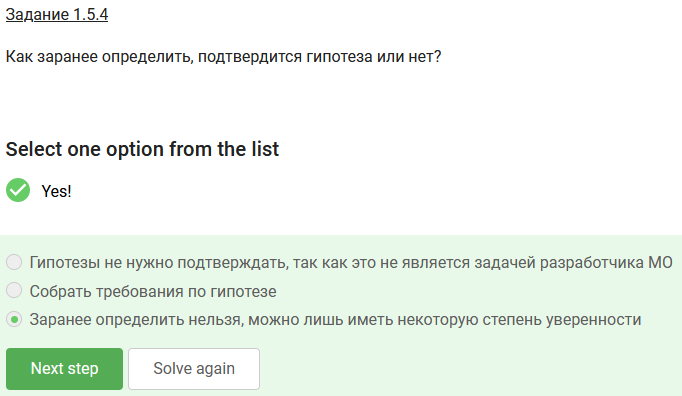

```
Задание 1.5.5
Выберите, какие этапы включает в себя решение задач машинного обучения:
```
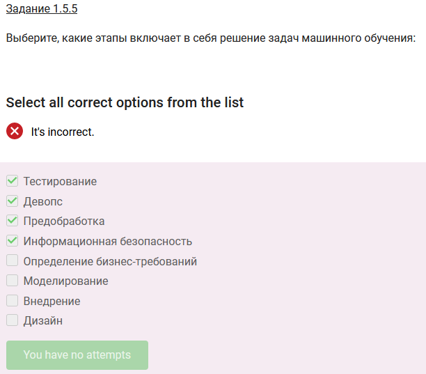


# 1.6 Определение бизнес-требований
```
Задание 1.6.1
Как расшифровывается MVP?
    Minimum Viable Product
```
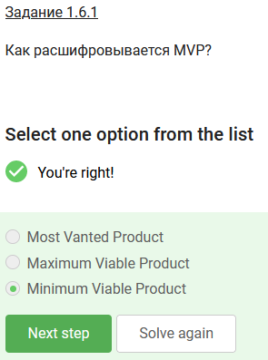

```
Задание 1.6.2
Укажите, какой должна быть цель:
    Значимая (релевантная)
    Ограниченная по времени
    Измеримая
    Конкретная
    Достижимая
```
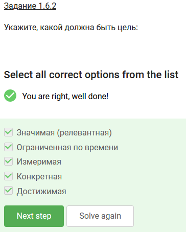

```
Задание 1.6.3
Вы работаете на заводе.
Перед вами два тезиса:
ускорить проход сотрудников на работу и с работы
и поставить систему биометрии по видео на вход. Выберите верные утверждения:
    Поставить систему биометрии — задача
    Ускорить проход сотрудников — цель (но пока не SMART)
```
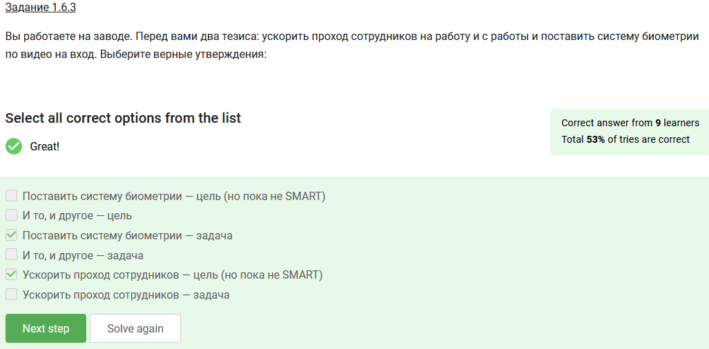

```
Задание 1.6.4
Задача — классифицировать документы некой компании, о которой вы ничего не знаете.
Как будете действовать на этапе определения требований?
    Узнаю, чем занимается компания
    Узнаю, на какие классы нужно классифицировать документы
    Узнаю, есть ли в данных структура
```
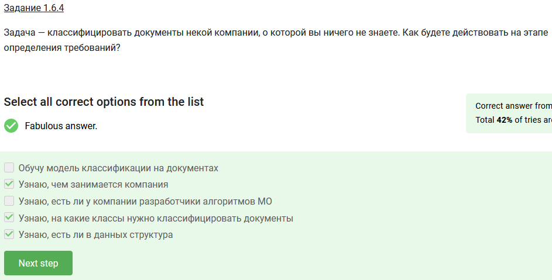


# 1.7 Сбор и подготовка данных
```
Задание 1.7.1
Что означает принцип «Garbage in — garbage out»?
    Если подать алгоритму плохие данные, он не научится выдавать хороший результат
```
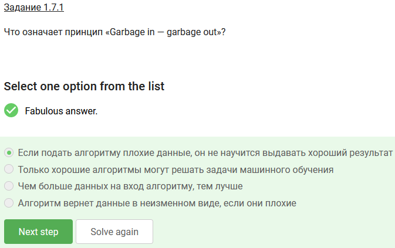

```
Задание 1.7.2
Что такое обогащение данных?
    Добавление новых данных извне
```
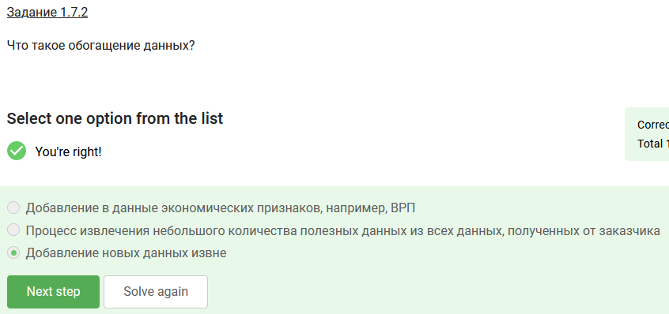

```
Задание 1.7.3
Что такое логирование/фиксирование действий?
    Регистрация, протоколирование действий, часто в хронологической последовательности
```
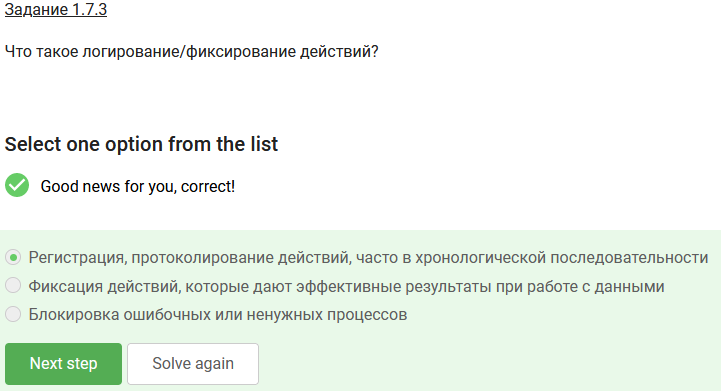

```
Задание 1.7.4
Вам нужно создать алгоритм для распознавания возраста по фотографии.
Заказчик дал фотографии людей от 18 до 30 лет, утверждая, что это основной возраст клиентов.
Что будете делать?
    Запрошу данные для других возрастов, чтобы дать более полную информацию модели
```
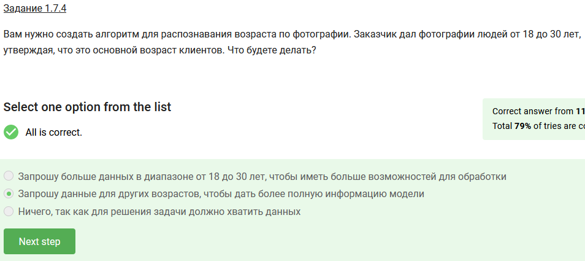


# 1.8 Разработка модели
```
Задание 1.8.1
Выберите, какие шаги нужно предпринять для обучения модели:
    Протестировать работу модели (провалидировать)
    Подать данные в алгоритм и дождаться обучения
    Выбрать гиперпараметры модели
    Выбрать алгоритм оптимизации
```
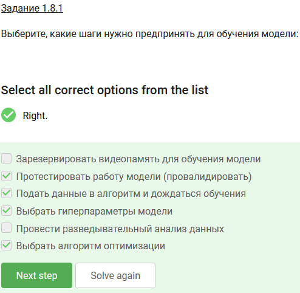

```
Задание 1.8.2
В какой последовательности идут этапы обучения модели?
    Делаем разведывательный анализ данных,
    выбираем гиперпараметры модели,
    обучаем и валидируем модель
```
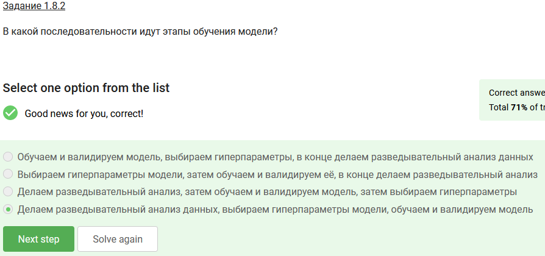

```
Задание 1.8.3
Укажите, может ли алгоритм машинного обучения идеально точно делать прогнозы в реальной задаче:
    В большинстве случаев нет, так как в реальном мире все задачи неточные,
    и везде есть влияние случайности, которую модель не сможет спрогнозировать
```
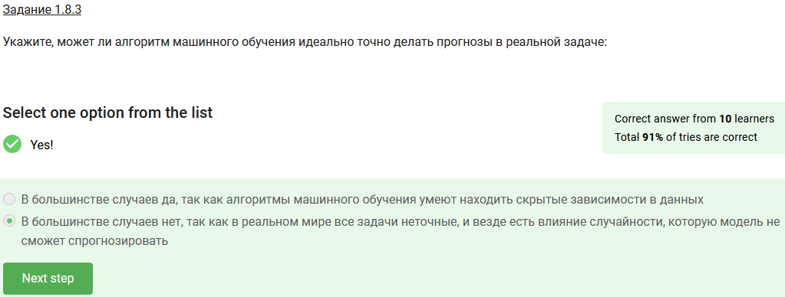

```
Задание 1.8.4
Выберите верные утверждения:
    Для обучения нейронных сетей желательно иметь видеокарту
    Некоторые алгоритмы МО можно параллелить
    Для обучения классических алгоритмов МО достаточно процессора
```
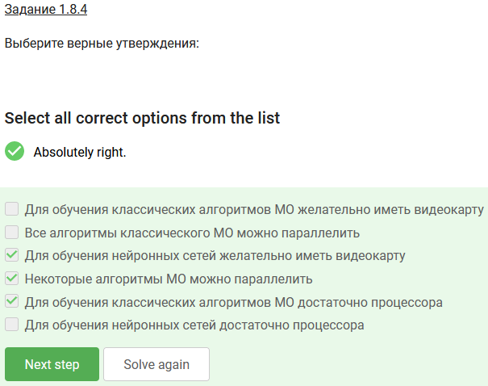


# 1.9 Тестирование и внедрение модели
```
Задание 1.9.1
Зачем нужно unit-тестирование?
    Для тестирования одной единицы функциональности в программе, например, загрузки данных
```
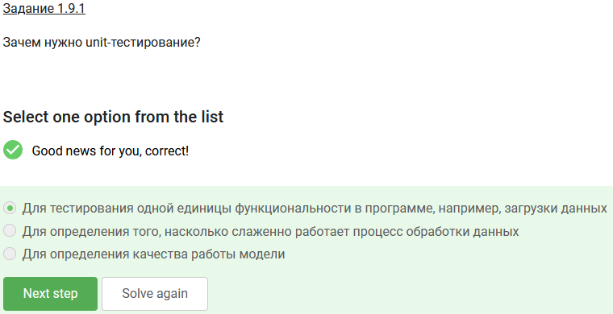

```
Задание 1.9.2
Зачем нужно нагрузочное тестирование?
    Для определения того, какую часть Pipeline оптимизировать
```


```
Задание 1.9.3
Зачем валидировать модель?
```
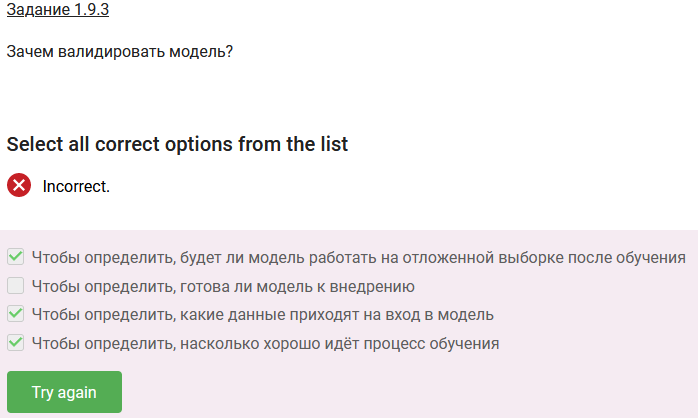

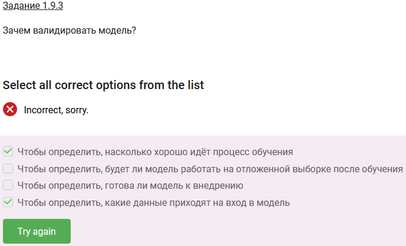

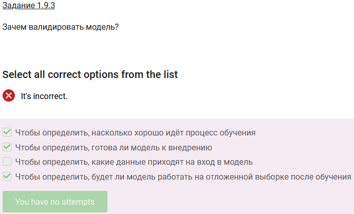

```
Задание 1.9.4
Что является примером интеграционного тестирования?
    Тестирование работы этапов Pipeline совместно
```
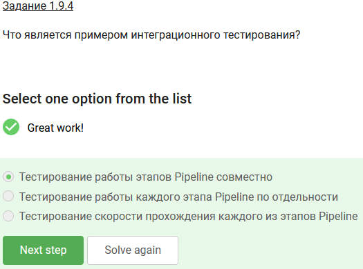

```
Задание 1.9.5
У заказчика на сайте настроена платная подписка.
Схема работы должна быть следующей:
сервис обрабатывает данные и создаёт подписку,
присылает информацию по оплате,
обрабатывает заказ,
предоставляет подписчику услугу.
Определите, какой вид тестирования следует использовать для проверки работы схемы:
    Интеграционные тесты
```
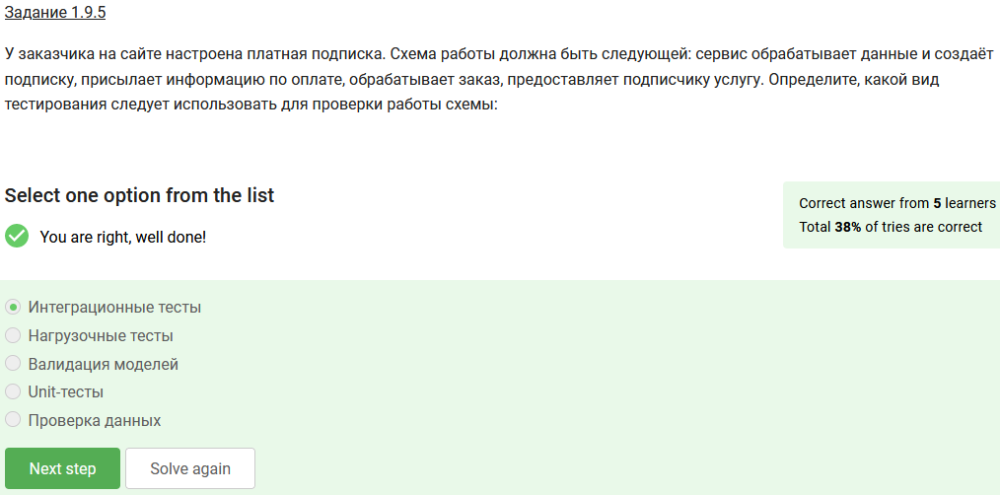


# 1.10 Проблемы разработки моделей
```
Задание 1.10.1
Можно ли с первого раза сделать рабочую модель?
    Да, если задача не из реального мира, а специально созданная для обучения
```
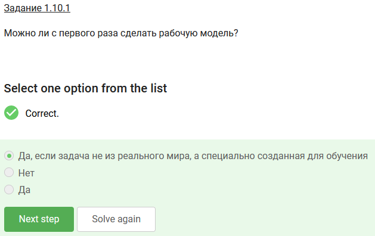

```
Задание 1.10.2
Какой этап Data Science разработки самый большой?
    Предобработка
```
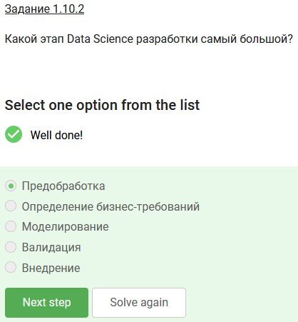

```
Задание 1.10.3
Из-за чего может оказаться так, что вы недооценили время, которое потратите на предобработку?
    Не учли всех бизнес-требований
    Не провели работу по предварительному исследованию данных
    У вас/ваших разработчиков оказалось недостаточно опыта для определения возможных проблем при предобработке
    У вас было недостаточно данных
```
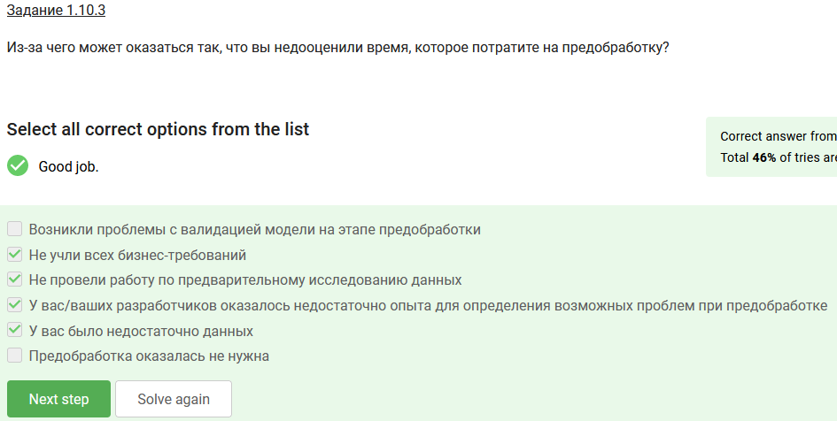


# 1.11 Советы и лайфхаки
```
Задание 1.11.1
Какие действия и в каком порядке лучше предпринять, чтобы решить задачу, если сроки ограничены и высокая точность не требуется?
    Поискать примеры схожих решённых задач, разработать минимальное рабочее решение, проверить его работоспособность
```
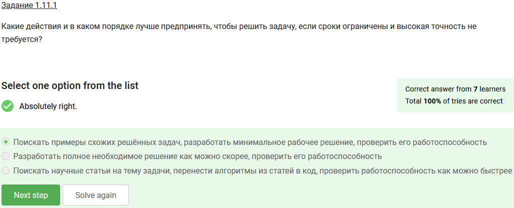

```
Задание 1.11.2
Как лучше проверять гипотезы в разработке Data Science?
    Придумать как можно больше небольших гипотез, потратить минимальное время на проверку каждой из них, дальше углубляться в те, которые показали хорошие результаты и делать на их основе MVP
```
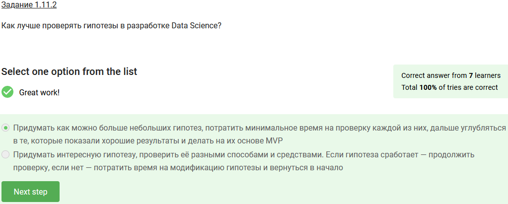

```
Задание 1.11.3
Выберите вредные советы по машинному обучению:
    Делайте всё как можно быстрее, меньше времени на подбор гипотез
    Подберите как можно больше полных, подробных гипотез
    Занимайтесь всеми процессами самостоятельно, так легче контролировать работу
    Делайте уникальные решения, не берите то, что уже есть
```
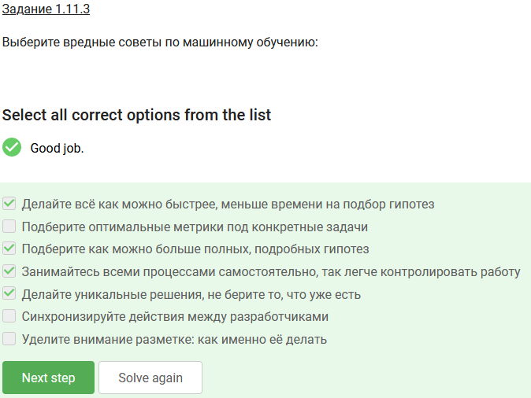


# 1.12 Jupiter
```
Задание 1.12.1
Какие виды ячеек есть в Jupyter?
    С кодом
    С текстом
```
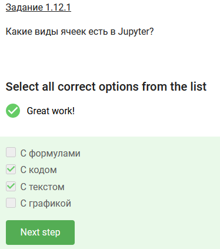

```
Задание 1.12.2
В каком режиме можно редактировать ячейки в Jupyter?
    В режиме правки
```
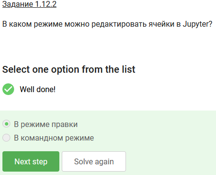

```
Задание 1.12.3
С помощью какого символа можно вызывать программы из командной строки в Jupyter?
    !
```
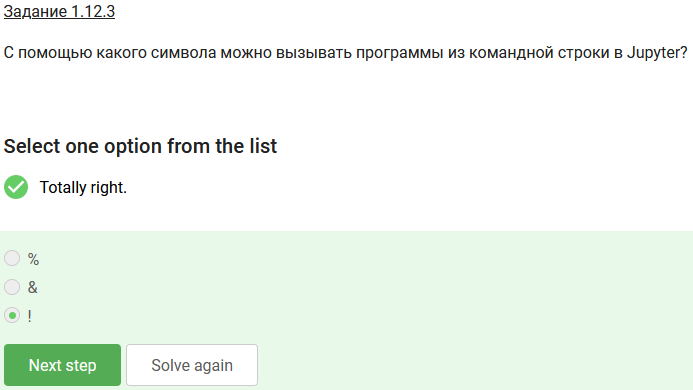

```
Задание 1.12.4
С помощью какого сочетания клавиш можно удалить текущую ячейку?
    dd
```
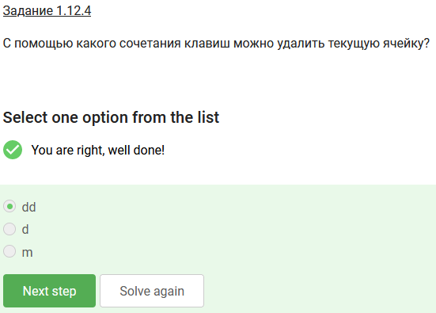

```
Задание 1.12.5
Что означает следующая команда: %%timeit?
    Замерить время выполнения текущей ячейки
```
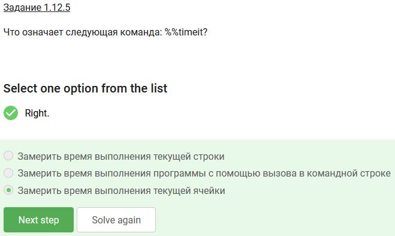


# 1.13 Процесс моделирования
```
Задание 1.13.1
Какой из алгоритмов показал лучший результат на данных без дополнительной предобработки?
    Градиентный бустинг
```
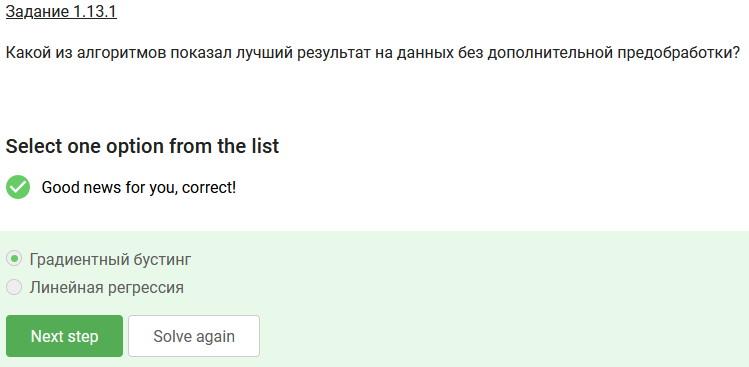

```
Задание 1.13.2
Какой способ внедрения мы использовали в этом примере?
    Мы не занимались внедрением в этом примере
```
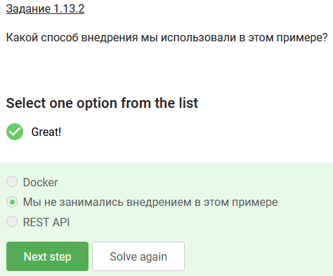

```
Задание 1.13.3
С помощью какой метрики мы валидировали модель?
    Средняя абсолютная ошибка
```
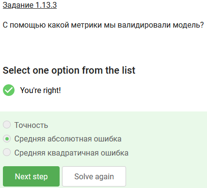
